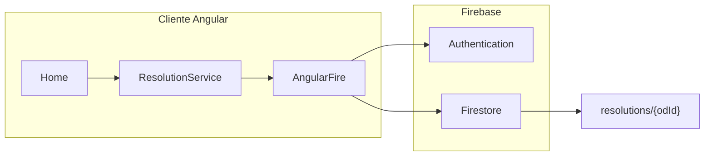

# Integrar Firestore con Autenticación

## Arquitectura propuesta



## Paso 1: Crear proyecto en Firebase Console

1. Ir a [Firebase Console](https://console.firebase.google.com)
2. Crear nuevo proyecto (ej. "resolutions-app")
3. Habilitar **Firestore Database** (modo producción)
4. Habilitar **Authentication** > Sign-in method > **Google** (el más simple para empezar)
5. Registrar app web y copiar el objeto `firebaseConfig`

## Paso 2: Instalar dependencias

```bash
npm install firebase @angular/fire
```

## Paso 3: Configurar Firebase en Angular

Crear archivo de entorno con las credenciales:

- Crear `src/environments/environment.ts` con el objeto `firebaseConfig`
- Crear `src/environments/environment.prod.ts` para producción

Actualizar [src/app/app.config.ts](src/app/app.config.ts):

- Importar `provideFirebaseApp`, `provideAuth`, `provideFirestore` de `@angular/fire`
- Inicializar con las credenciales del entorno

## Paso 4: Crear servicio de propósitos

Crear `src/app/services/resolution.service.ts`:

- Inyectar `Firestore` y `Auth`
- Métodos: `getResolutions$()`, `addResolution()`, `deleteResolution()`
- Filtrar por `userId` del usuario autenticado
- Colección: `resolutions` con documentos que incluyan `userId`, `name`, `description`, `startDate`, `endDate`, `createdAt`

## Paso 5: Crear servicio/componente de autenticación

Crear `src/app/services/auth.service.ts`:

- Métodos: `login()` (Google popup), `logout()`, `user$` (observable del usuario actual)

Modificar [src/app/components/header/header.html](src/app/components/header/header.html):

- Mostrar botón "Iniciar sesión" o avatar del usuario según estado

## Paso 6: Actualizar componente Home

Modificar [src/app/pages/home/home.ts](src/app/pages/home/home.ts):

- Inyectar `ResolutionService` y `AuthService`
- Reemplazar la señal local `resolutions` por un observable de Firestore
- Actualizar `saveResolution()` para llamar al servicio

## Paso 7: Configurar reglas de seguridad en Firestore

En Firebase Console > Firestore > Reglas:

```javascript
rules_version = '2';
service cloud.firestore {
  match /databases/{database}/documents {
    match /resolutions/{docId} {
      allow read, write: if request.auth != null 
        && request.auth.uid == resource.data.userId;
      allow create: if request.auth != null 
        && request.auth.uid == request.resource.data.userId;
    }
  }
}
```

## Paso 8: Consideraciones SSR

- Usar `isPlatformBrowser()` para evitar llamadas a Firebase en el servidor
- O configurar `@angular/fire` con `provideFirebaseApp(..., { schedulerIn: 'browser' })`

## Estructura de datos en Firestore

Colección `resolutions`:

- `userId`: string (UID del usuario)
- `name`: string
- `description`: string
- `startDate`: string (ISO date)
- `endDate`: string | null
- `createdAt`: timestamp